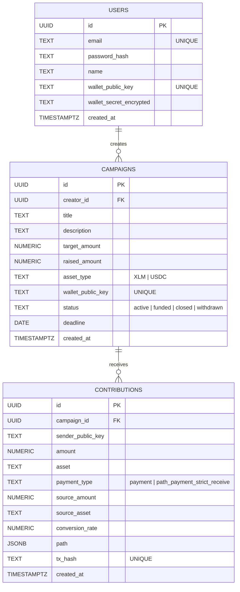

# Data Model

This document outlines the core foundational data models for CrowdPay: Users, Campaigns, and Contributions.

## Entities

- **Users**: Represents the platform users, including campaign creators.
- **Campaigns**: Represents funding campaigns created by users. Each campaign is tied to a specific target amount and asset on the Stellar network.
- **Contributions**: Represents individual payments made to a campaign. It handles path payment conversion details when applicable.

## Entity-Relationship Diagram

## Milestones & Withdrawals

### milestones
Tracks campaign milestones tied to partial fund releases.

| Column | Type | Notes |
|---|---|---|
| id | UUID PK | |
| campaign_id | UUID FK → campaigns | ON DELETE CASCADE |
| title | TEXT | |
| description | TEXT | |
| release_percentage | NUMERIC(7,4) | 0–100 |
| sort_order | INT | display order |
| evidence_url | TEXT | |
| destination_key | TEXT | Stellar payout key |
| review_note | TEXT | |
| status | TEXT | pending / approved / released |
| created_at, completed_at, approved_at, released_at | TIMESTAMPTZ | |

### withdrawal_requests
Dual-signature (creator + platform) fund withdrawal requests.

| Column | Type | Notes |
|---|---|---|
| id | UUID PK | |
| campaign_id | UUID FK → campaigns | |
| requested_by | UUID FK → users | |
| milestone_id | UUID FK → milestones | nullable, unique when set |
| dispute_id | UUID FK → disputes | nullable |
| amount | NUMERIC(20,7) | |
| destination_key | TEXT | |
| unsigned_xdr | TEXT | pending Stellar transaction |
| creator_signed, platform_signed | BOOLEAN | |
| status | TEXT | pending / on_hold / submitted / failed / denied |
| denial_reason | TEXT | |
| tx_hash | TEXT | |
| created_at | TIMESTAMPTZ | |

### withdrawal_approval_events
Immutable audit trail for withdrawal actions (requested, creator_signed, platform_signed, creator_cancelled, platform_rejected, submit_failed).

### disputes
Contributor-raised disputes against a campaign.

| Column | Type | Notes |
|---|---|---|
| id | UUID PK | |
| campaign_id | UUID FK → campaigns | |
| raised_by | UUID FK → users | |
| reason | TEXT | non_delivery / misrepresentation / abandoned / other |
| description | TEXT | |
| evidence_url | TEXT | |
| status | TEXT | open / under_review / resolved_creator / resolved_contributor / closed |
| resolution_note | TEXT | |
| created_at, resolved_at | TIMESTAMPTZ | |

One open/under_review dispute allowed per contributor per campaign.

### dispute_events
Audit log for actions taken on a dispute (actor, action, note, timestamp).

### reward_tiers
Optional backer perk tiers per campaign (0–10 tiers, minimum contribution amount, optional claim limit).

### contribution_rewards
Join table mapping a contribution to the reward tier it qualified for.

### campaign_members
Team/collaborator access to a campaign (owner / manager / editor / viewer), with email-based invites.

### anchor_deposits
Fiat on/off-ramp deposit sessions via Stellar SEP-24 anchors (MoneyGram or custom). `deposit_type` distinguishes wallet-level vs campaign-level deposits.

### ledger_stream_cursors
Per-campaign-wallet Horizon streaming cursor position, used for health monitoring of the live payment ingestion pipeline.
## Authentication & Sessions

### refresh_tokens
JWT refresh token storage for session renewal.

| Column | Type | Notes |
|---|---|---|
| id | UUID PK | |
| user_id | UUID FK → users | ON DELETE CASCADE |
| token_hash | TEXT UNIQUE | hashed, not raw |
| expires_at | TIMESTAMPTZ | |
| revoked_at | TIMESTAMPTZ | nullable |
| created_at | TIMESTAMPTZ | |

### user_sessions
Active session tracking per device, linked 1:1 to a refresh token.

| Column | Type | Notes |
|---|---|---|
| id | UUID PK | |
| user_id | UUID FK → users | |
| refresh_token_id | UUID FK → refresh_tokens | UNIQUE |
| device_fingerprint | TEXT | |
| ip_address | INET | |
| user_agent | TEXT | |
| location_country, location_city | TEXT | |
| created_at, last_seen_at, revoked_at | TIMESTAMPTZ | |

### login_attempts
Every login attempt (success or failure), used for anomaly detection.

| Column | Type | Notes |
|---|---|---|
| id | UUID PK | |
| user_id | UUID FK → users | nullable (failed lookups) |
| email | TEXT | |
| ip_address | INET | |
| user_agent | TEXT | |
| device_fingerprint | TEXT | |
| success | BOOLEAN | |
| failure_reason | TEXT | |
| location_country, location_city | TEXT | |
| created_at | TIMESTAMPTZ | |

### login_alerts
Flags suspicious login activity (new device, new location, suspicious IP, repeated failures).

| Column | Type | Notes |
|---|---|---|
| id | UUID PK | |
| user_id | UUID FK → users | |
| alert_type | TEXT | new_device / new_location / suspicious_ip / multiple_failures |
| ip_address, device_fingerprint, location_country, location_city | — | |
| details | JSONB | |
| acknowledged | BOOLEAN | |
| acknowledged_at | TIMESTAMPTZ | |
| created_at | TIMESTAMPTZ | |

### users (additional fields beyond the core model above)
Extended over time via migrations, `users` also includes:

| Column | Type | Notes |
|---|---|---|
| totp_secret | TEXT | |
| totp_enabled | BOOLEAN | |
| backup_codes | TEXT[] | |
| kyc_status | ENUM | unverified / pending / verified / rejected |
| kyc_provider_reference | TEXT | unique, nullable |
| kyc_completed_at | TIMESTAMPTZ | |
| email_verified | BOOLEAN | referenced in API.md, gates campaign creation |

> Note: TOTP and KYC are implemented as columns on `users`, not separate tables, despite being listed as candidate tables in the original issue.
## Notifications & Webhooks

### notifications
In-app notifications delivered to users.

| Column | Type | Notes |
|---|---|---|
| id | UUID PK | |
| user_id | UUID FK → users | ON DELETE CASCADE |
| type | TEXT | |
| title | TEXT | |
| body | TEXT | |
| link | TEXT | |
| read_at | TIMESTAMPTZ | nullable |
| created_at | TIMESTAMPTZ | |

### campaign_webhooks
Creator-registered webhook endpoints for campaign contribution events.

| Column | Type | Notes |
|---|---|---|
| id | UUID PK | |
| campaign_id | UUID FK → campaigns | ON DELETE CASCADE |
| url | TEXT | |
| secret | TEXT | HMAC signing secret |
| events | TEXT[] | default: contribution.indexed |
| active | BOOLEAN | |
| created_at | TIMESTAMPTZ | |

### campaign_webhook_deliveries
Delivery attempts and retry state for campaign webhooks.

| Column | Type | Notes |
|---|---|---|
| id | UUID PK | |
| webhook_id | UUID FK → campaign_webhooks | ON DELETE CASCADE |
| event | TEXT | |
| payload | JSONB | |
| response_status | INT | |
| delivered_at, failed_at | TIMESTAMPTZ | |
| error, last_error | TEXT | |
| attempt_count | INT | |
| status | TEXT | pending / delivering / delivered / failed / retrying |
| next_retry_at | TIMESTAMPTZ | |
| created_at, updated_at | TIMESTAMPTZ | |

## Referrals & Rewards

### referral_rewards
Earned/paid referral bonuses, with tiered reward support.

| Column | Type | Notes |
|---|---|---|
| id | UUID PK | |
| referrer_user_id | UUID FK → users | |
| referred_user_id | UUID FK → users | |
| campaign_id | UUID FK → campaigns | |
| referral_code | TEXT | |
| reward_type | TEXT | credit / token_drop |
| amount | NUMERIC(20,7) | |
| asset_type | TEXT | XLM / USDC |
| status | TEXT | earned / paid_out / cancelled |
| tier_level | INTEGER | |
| earned_at, paid_out_at, created_at | TIMESTAMPTZ | |

### referral_fraud_checks
Flags potential referral abuse (same person, IP clustering, device clustering).

| Column | Type | Notes |
|---|---|---|
| id | UUID PK | |
| referrer_user_id, referred_user_id | UUID FK → users | |
| ip_address | INET | |
| device_fingerprint | TEXT | |
| user_agent | TEXT | |
| fraud_type | TEXT | same_person / ip_clustering / device_clustering |
| detected_at | TIMESTAMPTZ | |
| resolved | BOOLEAN | |
| resolved_at | TIMESTAMPTZ | |
| notes | TEXT | |

## Anchors & Ledger Monitoring

### anchor_deposits
Fiat on/off-ramp sessions via Stellar SEP-24 anchors (MoneyGram or custom-configured anchors).

| Column | Type | Notes |
|---|---|---|
| deposit_type | TEXT | wallet / campaign |
| campaign_id | UUID FK → campaigns | nullable for wallet-only deposits |

*(Full column set not confirmed beyond this migration snippet — additional fields likely exist for anchor transaction tracking; recommend confirming with a maintainer or the anchor deposit service code.)*

### ledger_stream_cursors
Tracks per-campaign-wallet Horizon streaming position for the live payment ingestion pipeline. Used by the `/health/ledger` endpoint to detect stale/disconnected streams.

---

## Tables Not Found in Reviewed Migrations

The original documentation request referenced `api_keys` and `feature_flags`/`feature_flag_assignments` tables. These were not located in the migrations reviewed for this update — they may not exist yet, may be planned for a future migration, or may live under different table names. Flagging for a maintainer to confirm rather than guessing at their structure.